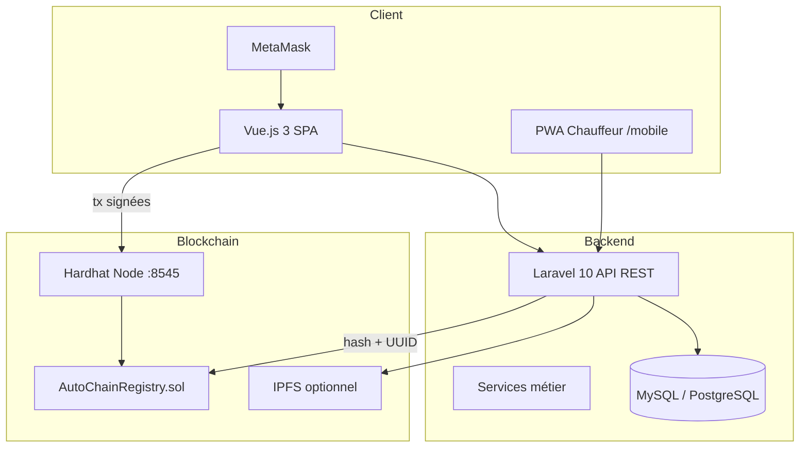
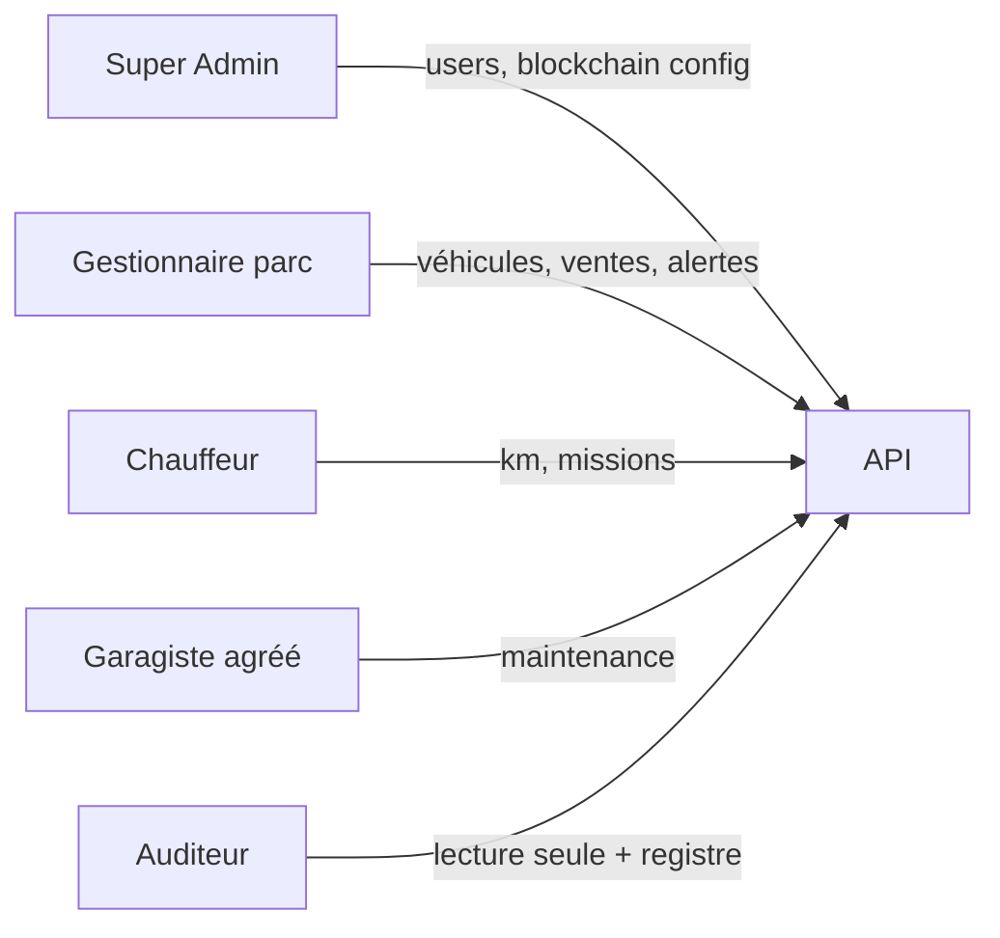
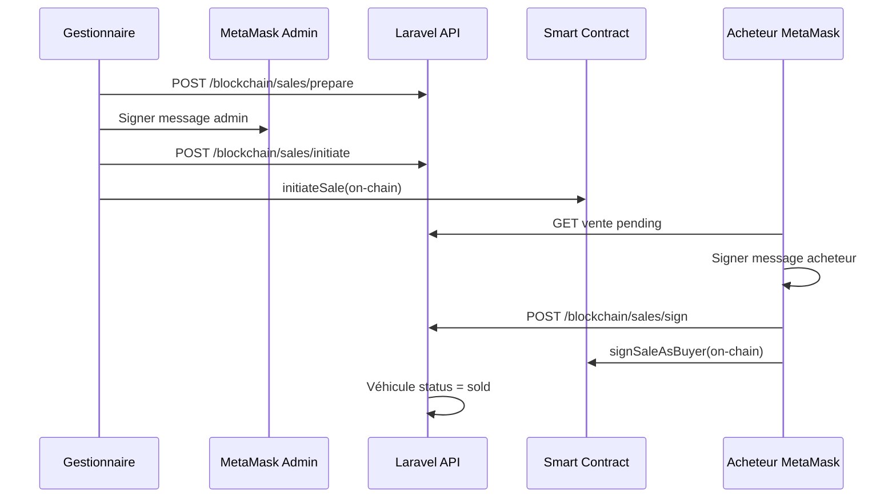
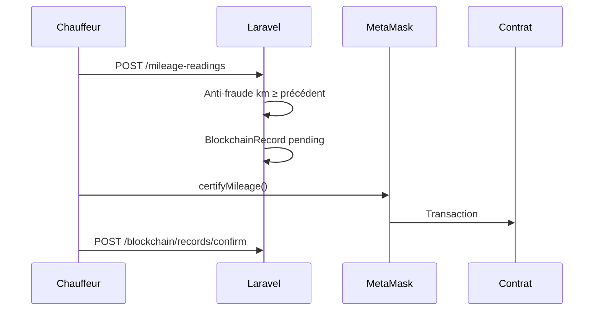

# AutoChain Emma+ — Architecture technique

**Auteur : Moïse** | Projet de fin d'année — Gestion de parc automobile + blockchain

---

## 1. Vue d'ensemble (double numérique)



---

## 2. Acteurs et rôles



---

## 3. Flux vente double signature



---

## 4. Flux certification kilométrage



---

## 5. Stack technique

| Couche | Technologies |
|--------|--------------|
| Frontend | Vue 3, Pinia, Vue Router, Vite, ethers.js 6 |
| Backend | Laravel 10, Sanctum, Eloquent |
| BDD | PostgreSQL (prod) / MySQL (dev Laragon) |
| Blockchain | Solidity 0.8.20, Hardhat, chainId 31337 |
| Storage | Filesystem documents + IPFS (certificats publics) |
| Mobile | PWA (manifest + service worker) |

---

## 6. Sécurité & RGPD

- **On-chain** : UUID véhicule + hash SHA-256 uniquement
- **Off-chain** : données nominatives, documents chiffrés par intégrité hash
- **API** : middleware rôles, Sanctum Bearer tokens
- **RGPD** : `GET /api/v1/rgpd/export`, `DELETE /api/v1/rgpd/account`, politique `/privacy`

---

## 7. Modules backend

```
app/Services/
├── BlockchainService.php    # Preuves, hash, confirmation tx
├── AlertEngineService.php   # Alertes + email
├── DocumentService.php      # Upload, intégrité
├── IpfsService.php          # Pin IPFS
├── SaleSignatureService.php # Double signature vente
├── TimelineService.php      # Historique agrégé
├── ExportService.php        # CSV + rapport flotte
└── Web3AuthService.php      # Auth wallet MetaMask
```

---

## 8. Déploiement local (soutenance)

```bash
# Terminal 1
cd blockchain && npm run node

# Terminal 2
php artisan serve

# Terminal 3
npm run dev

# Activer blockchain
php artisan autochain:sync-blockchain --enable
```

Voir **SOUTENANCE.md** pour le scénario jury complet.
